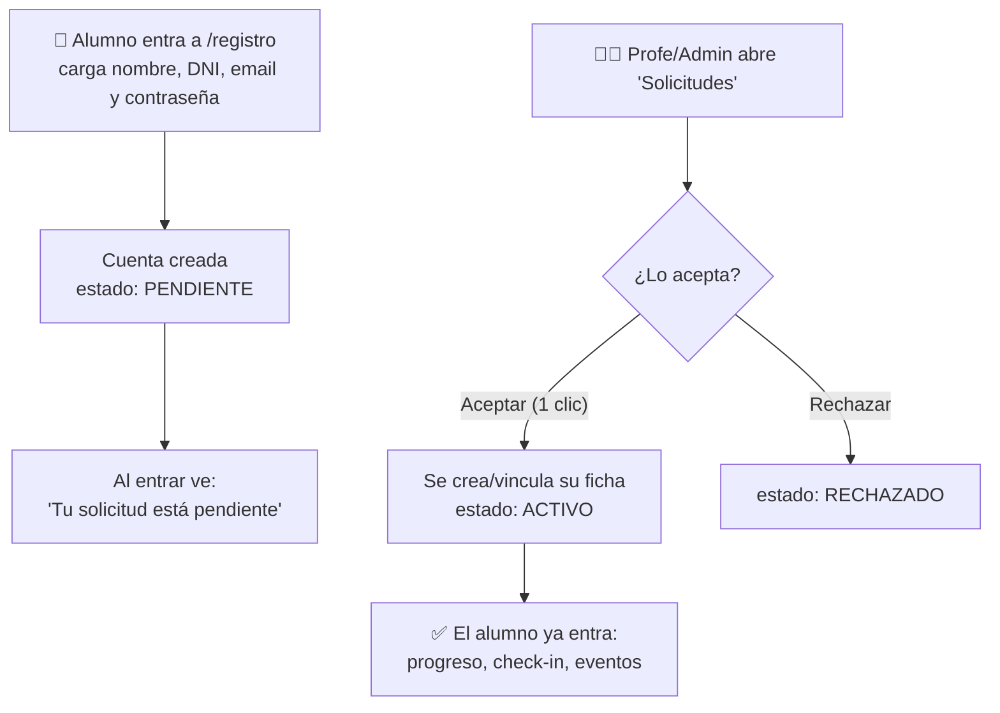
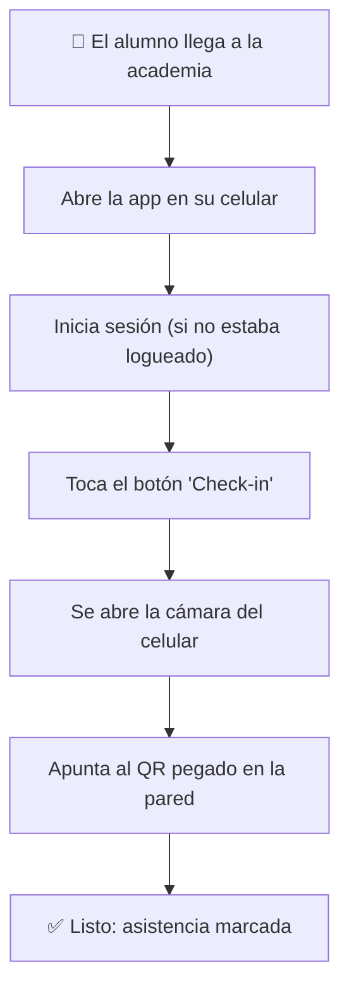
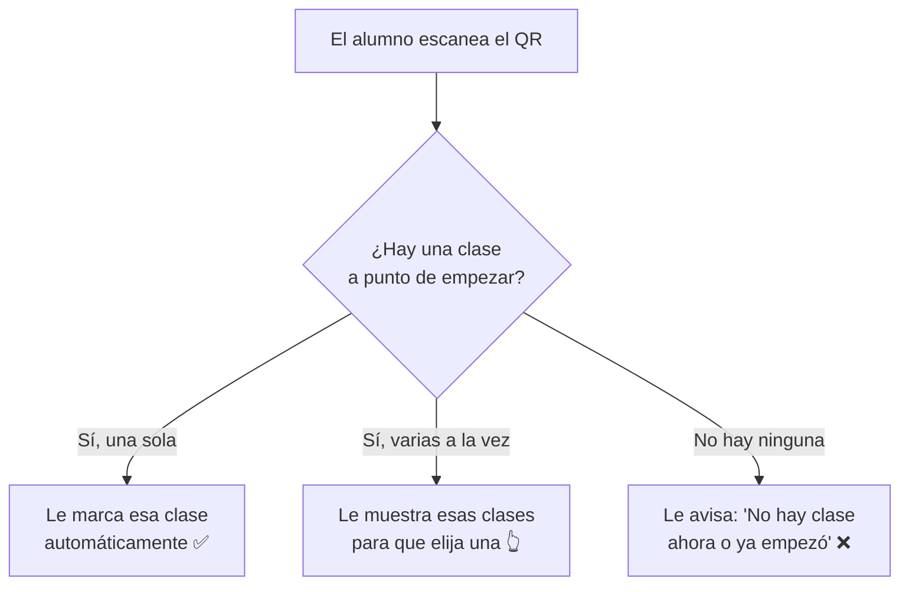

# Cómo va a funcionar el check-in con QR

Este documento explica, **sin tecnicismos**, cómo los alumnos van a marcar su asistencia
escaneando el QR de la academia. La idea es que se entienda el flujo de punta a punta.

---

## Los 3 tipos de usuario

| Quién | Para qué entra a la app | ¿Necesita usuario y contraseña? |
|-------|--------------------------|---------------------------------|
| 🥋 **Alumno** | Ver su progreso y **marcar asistencia escaneando el QR** | Sí |
| 👨‍🏫 **Profesor** | Ver quién vino a cada clase | Sí |
| 🛠️ **Admin** | Cargar alumnos, clases, **horarios** y el QR | Sí |

> **Cambio importante:** antes el alumno marcaba asistencia tipeando su DNI en una tablet
> de la entrada, sin cuenta. **Ahora cada alumno tiene su cuenta y escanea desde su celular.**

---

## Cómo tiene cuenta un alumno: registro + aprobación

El alumno se **registra solo** desde la app. La cuenta no funciona hasta que un
**profesor o admin la acepta**. Recién ahí queda asociada a su ficha (la del DNI) y
puede usar todo.



- **Aceptar** crea la ficha del alumno automáticamente (cinturón blanco, fecha de hoy).
  Si ya existía una ficha con ese DNI, la vincula en vez de duplicarla. El profe puede
  ajustar el cinturón/fecha después en **Alumnos**.
- Mientras está **pendiente**, el alumno puede entrar pero solo ve la pantalla de espera.
- El panel **Solicitudes** lo ven tanto el profesor como el admin.

> Para crear el primer admin/profesor: registrarse normal y luego promover la cuenta
> desde Supabase (está documentado en `supabase/04_seed.sql`).

---

## El QR de la academia

- Es **uno solo** para toda la academia.
- El admin lo genera **una vez** desde la sección **QR**.
- Se **imprime y se pega en la pared** de la entrada.
- No cambia nunca (salvo que el admin lo regenere a propósito).

```
        ┌─────────────────────┐
        │  ▄▄▄▄▄  ▄▄  ▄▄▄▄▄    │
        │  █   █ ▄██▄ █   █    │   ← este cartel queda
        │  █▄▄▄█ ▀██▀ █▄▄▄█    │     pegado en la pared
        │  ▄▄▄▄▄ █  █ ▄▄▄▄▄    │
        └─────────────────────┘
           Academia Principal
```

---

## Lo que el admin prepara una sola vez: los HORARIOS

Para que el sistema sepa **qué clase es** cuando alguien escanea, el admin carga la grilla
de horarios en una sección nueva llamada **Horarios**.

Ejemplo:

| Clase | Días | Horario |
|-------|------|---------|
| Gi | Lunes, Miércoles, Viernes | 19:00 a 20:30 |
| No-Gi | Martes, Jueves | 20:00 a 21:30 |
| Kids | Lunes a Viernes | 18:00 a 19:00 |

Esto se carga **una vez** y se repite todas las semanas.

---

## El flujo del alumno (paso a paso)



El alumno **no tiene que elegir nada ni escribir su DNI**: con escanear alcanza.
El sistema ya sabe quién es (porque inició sesión) y qué clase es (por la hora + los horarios).

---

## ¿Qué clase le toma el sistema?

Cuando el alumno escanea, el sistema mira la **hora actual** y la compara con los **horarios**:



---

## La regla del horario (importante)

El alumno puede marcar asistencia **desde 30 minutos antes** de que empiece la clase,
y **hasta la hora de inicio**. Si llega tarde, **ya no puede marcarla** desde la app.

Ejemplo con la clase de **Gi a las 19:00**:

```
   18:30 ───────────────── 19:00 ───────────────── 20:30
     │                       │
     │   ✅ puede marcar      │   ❌ ya no puede (la clase empezó)
     │                       │
   se abre el              empieza
   check-in               la clase
```

- Llega 18:45 → **puede marcar** ✅
- Llega 19:01 → **no puede**, llegó tarde ❌ (el profesor igual puede cargarlo a mano)

> Estos 30 minutos son un número que podemos cambiar fácil si lo querés más largo o más corto.

---

## Qué ve cada uno

### 🥋 Alumno (sección **Alumno**)
- Su progreso (cinturón, clases que cuentan, cuánto le falta).
- Un botón nuevo **Check-in** que abre la cámara para escanear.

### 👨‍🏫 Profesor (sección **Profesor**)
- La lista de quiénes vinieron a cada clase del día.
- Puede agregar o quitar presentes a mano (por si alguien llegó tarde y no pudo escanear).

### 🛠️ Admin (sección **Admin**)
- Alumnos, tipos de clase, cinturones.
- **QR** de la academia (generar / imprimir).
- **Horarios** (sección nueva) para definir días y horas de cada clase.

---

## Resumen en una frase

> El admin pega **un QR** en la pared y carga los **horarios**.
> El alumno se **loguea**, toca **Check-in**, **escanea el QR** con su celu,
> y el sistema le marca **la clase que corresponde a esa hora** — siempre que no haya empezado todavía.
