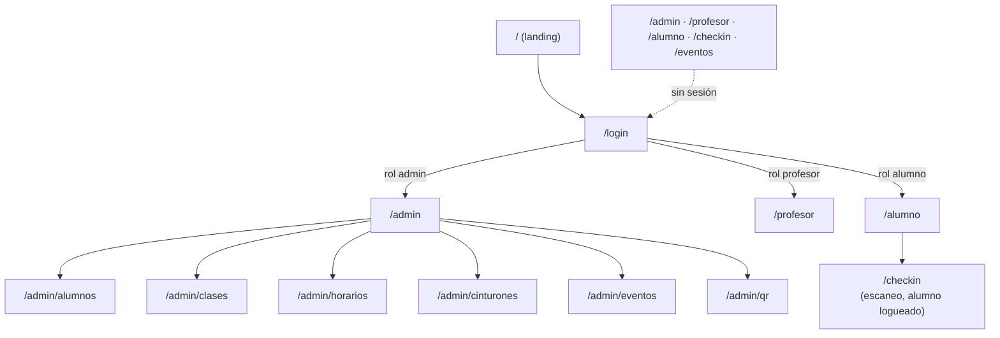
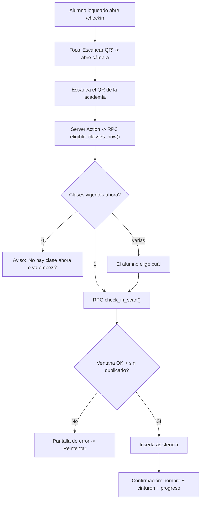

# Vistas y flujos

Mockups (wireframes en texto) de cada pantalla + diagramas de navegación y del flujo de check-in. Los diagramas Mermaid se renderizan automáticamente en GitHub.

---

## Mapa de navegación



> Solo `/` y `/login` son públicas. `/checkin` ahora **requiere sesión de alumno**: el alumno
> escanea el QR de la academia desde su celular. Ver el flujo completo en
> [CHECKIN-FLUJO.md](CHECKIN-FLUJO.md).

---

## Flujo de check-in (escaneo del alumno logueado)



> Ventana de check-in: desde 30 min antes del inicio hasta la hora de inicio (si la clase
> ya empezó, no se puede). La clase vigente se resuelve con la grilla de `/admin/horarios`.

---

## Landing — `/`

```
┌─────────────────────────────────────────────┐
│                 BJJ Tracker                   │
│       Asistencia y progreso para tu academia  │
│                                               │
│   ┌──────────────┐    ┌──────────────┐        │
│   │  Check-in     │    │   Admin       │       │
│   │  Kiosko QR…   │    │  Alumnos…     │       │
│   └──────────────┘    └──────────────┘        │
│   ┌──────────────┐    ┌──────────────┐        │
│   │  Profesor     │    │   Alumno      │       │
│   │  Presentes…   │    │  Progreso…    │       │
│   └──────────────┘    └──────────────┘        │
└─────────────────────────────────────────────┘
```

---

## Check-in — `/checkin?academy=TOKEN`

### Paso 1 — Tipo de clase + DNI

```
┌──────────────── Check-in ─────────────────┐
│             Academia Principal             │
│           Registrá tu asistencia           │
│                                            │
│  Tipo de clase                             │
│  [  Gi  ] [ No-Gi ] [ Kids ] [ Comp. ]     │
│   ▲ seleccionado se resalta                │
│                                            │
│  Tu DNI                                    │
│  ┌──────────────────────────────────────┐ │
│  │              30111222                 │ │
│  └──────────────────────────────────────┘ │
│         ┌───┐ ┌───┐ ┌───┐                  │
│         │ 1 │ │ 2 │ │ 3 │                  │
│         │ 4 │ │ 5 │ │ 6 │                  │
│         │ 7 │ │ 8 │ │ 9 │                  │
│         │ ⌫ │ │ 0 │ │Bor│                  │
│         └───┘ └───┘ └───┘                  │
│                                            │
│   [      Registrar asistencia          ]   │
└────────────────────────────────────────────┘
```

### Paso 2 — Confirmación

```
┌──────────────── Check-in ─────────────────┐
│                  ( ✓ )                     │
│            ¡Listo, Juan Pérez!             │
│            Asistencia registrada           │
│                                            │
│             [ Cinturón Azul ]              │
│                                            │
│   41/200 para Violeta         faltan 159   │
│   ████████░░░░░░░░░░░░░░░░░░░░░░   21%      │
│                                            │
│   [          Otro alumno             ]     │
│         (auto-reset en 8 segundos)         │
└────────────────────────────────────────────┘
```

---

## Admin — `/admin/alumnos`

```
┌────────────────────────────────────────────────┐
│ BJJ Tracker · Admin                     [Salir] │
│ [Alumnos]  Tipos de clase  Cinturones  QR       │  ← nav
├────────────────────────────────────────────────┤
│ Alumnos                        [ Nuevo alumno ] │
│ 3 alumnos                                       │
│ ┌────────────────────────────────────────────┐ │
│ │ Nombre       DNI       Cinturón  Desde   …│ │
│ │ Juan Pérez   30111222  [Azul]    2022-03  │ │
│ │                         [Editar] [Eliminar]│ │
│ │ María Gómez  28999888  [blanco]  2024-09  │ │
│ │ Lucas Fern.  33444555  [Violeta] 2019-06  │ │
│ └────────────────────────────────────────────┘ │
└────────────────────────────────────────────────┘
```

### Diálogo: crear / editar alumno

```
┌──── Nuevo alumno ─────┐
│ DNI      [__________] │
│ Nombre   [__________] │
│ Cinturón [  Azul    ▾]│
│ Inicio   [2022-03-01] │
│         [  Crear  ]   │
└───────────────────────┘
```

---

## Admin — `/admin/clases`

Toggles que guardan al instante. `Cuenta p/ progreso` define si ese tipo suma para subir de cinturón.

```
│ Tipos de clase                                  │
│ [ Nuevo tipo (ej. Open Mat) ]      [ Agregar ]  │
│ ┌─────────────────────────────────────────────┐│
│ │ Nombre        Activo    Cuenta p/ progreso  ││
│ │ Gi             (●─)         (●─)             ││
│ │ No-Gi          (●─)         (●─)             ││
│ │ Kids           (●─)         (─○)             ││
│ │ Competición    (●─)         (─○)             ││
│ └─────────────────────────────────────────────┘│
│        (●─) = ON      (─○) = OFF                 │
```

---

## Admin — `/admin/cinturones`

```
│ Configuración de cinturones                     │
│ Clases requeridas para pasar al siguiente        │
│ ┌─────────────────────────────────────────────┐│
│ │ Tramo                Requeridas    Acción    ││
│ │ [blanco] → [Azul]    [  150  ]    [Guardar]  ││
│ │ [Azul] → [Violeta]   [  200  ]    [Guardar]  ││
│ │ [Violeta] → [Marrón] [  200  ]    [Guardar]  ││
│ │ [Marrón] → [negro]   [  250  ]    [Guardar]  ││
│ └─────────────────────────────────────────────┘│
```

---

## Admin — `/admin/qr`

```
│ QR de la academia                               │
│ Imprimí y pegá en la entrada                     │
│        ┌─────────────────────┐                   │
│        │ ▄▄▄▄▄  ▄▄  ▄▄▄▄▄     │                   │
│        │ █   █ ▄██▄ █   █     │    Academia       │
│        │ █▄▄▄█ ▀██▀ █▄▄▄█     │    Principal      │
│        │ ▄▄▄▄▄ █  █ ▄▄▄▄▄     │                   │
│        └─────────────────────┘                   │
│           11111111-1111-…                         │
│                                                  │
│   [ Imprimir ]  [ Copiar URL ]  [ Regenerar ]    │
```

---

## Profesor — `/profesor`

```
┌────────────────────────────────────────────────┐
│ Panel del profesor                      [Salir] │
│                                                 │
│ Tipo: [ Gi ▾]   Fecha: [2026-06-23]  [+Presente]│
│ 2 presentes                                     │
│ ┌────────────────────────────────────────────┐ │
│ │ Alumno     Cint.   Hora   Progreso     Acc.│ │
│ │ Juan Pérez [Azul]  19:05  41/200·f159 [Quit]│
│ │ Lucas F.   [Viol.] 19:05  91/200·f109 [Quit]│
│ └────────────────────────────────────────────┘ │
└────────────────────────────────────────────────┘
        f159 = faltan 159 para el siguiente cinturón
```

### Diálogo: agregar presente (corrección manual)

```
┌──── Agregar presente ────┐
│ Alumno [ Elegí…       ▾] │  ← solo alumnos ausentes
│        [  Agregar  ]     │
└──────────────────────────┘
```

> El tipo de clase por defecto es el que más presentes tiene ese día.

---

## Alumno — `/alumno`

```
┌────────────────────────────────────────────────┐
│ juan@mail.com                           [Salir] │
│                                                 │
│ Juan Pérez                           [  Azul  ] │
│ En la academia desde 2022-03-01                 │
│                                                 │
│ ┌──────────┐  ┌──────────┐  ┌──────────┐        │
│ │    41    │  │   200    │  │   159    │        │
│ │ que      │  │requeridas│  │ te       │        │
│ │ cuentan  │  │ p/ subir │  │ faltan   │        │
│ └──────────┘  └──────────┘  └──────────┘        │
│                                                 │
│ Progreso hacia Violeta                    21%   │
│ ████████░░░░░░░░░░░░░░░░░░░░░░░░░░░░             │
│                                                 │
│ Últimas clases                                  │
│  2026-06-23   19:05   Gi                        │
│  2026-06-22   19:00   No-Gi                     │
│  2026-06-21   19:00   Gi                        │
└────────────────────────────────────────────────┘
```

---

## Login — `/login`

```
┌──── Iniciar sesión ─────┐
│ Email     [___________] │
│ Contraseña[___________] │
│       [   Entrar    ]   │
└─────────────────────────┘
```

> En modo desarrollo (mock o `DEV_BYPASS_ROLE`) esta pantalla muestra un aviso de "login deshabilitado" en lugar del formulario.
